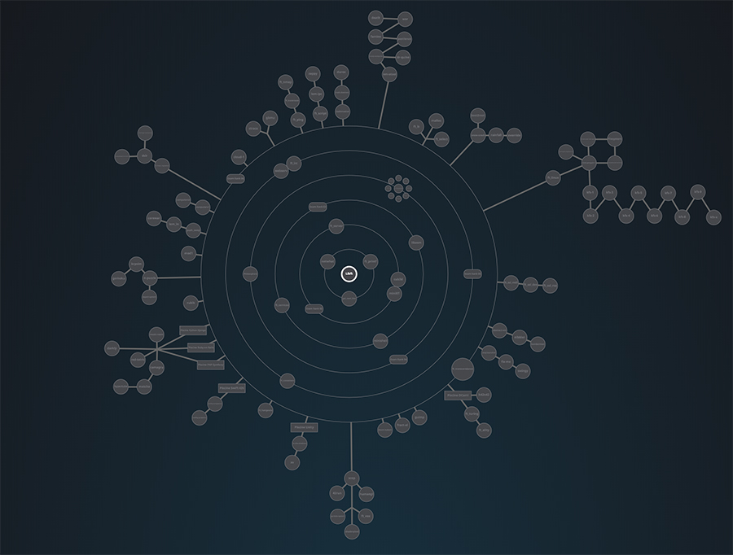

# 42_Cursus


This repository contains all the projects (completed to date) of the School of Programming 42.

To clone the **master** repository with all project repositories run the following terminal command
```
git clone --recursive https://github.com/Bortize/42_Cursus.git
```
To clone a **specific module** (for example: 42_libft) you you must execute the following command
```
git clone --recursive https://github.com/Bortize/42_libft.git
```
